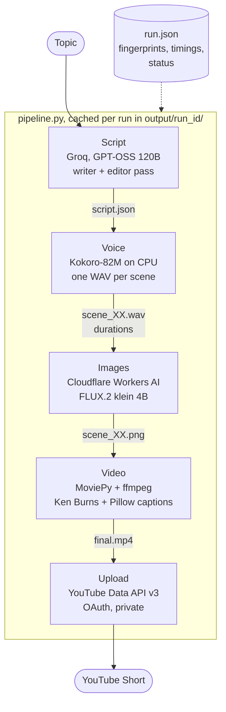

# ShortForge

Type a topic, get a finished YouTube Short: scripted by an LLM, voiced locally, illustrated with generated photos, captioned, and uploaded. Runs on a CPU-only laptop for $0 per video.

<p align="center">
  
</p>

**Watch a full Short:** [What is a vector database?](https://youtube.com/shorts/Jxdu2BLd8Uo), made with one command:

```powershell
shortforge "What is a vector database" --upload
```

## What it does

1. **Script.** An LLM writes a 30 to 50 second script in 5 to 7 scenes: a hook, a plain explanation, and a payoff. A second pass edits it. Every scene has narration and a photo description.
2. **Voice.** Kokoro TTS reads each scene separately on the CPU. Each clip's length becomes that scene's length on screen.
3. **Images.** FLUX.2 generates one realistic 9:16 photo per scene.
4. **Video.** Each photo gets a slow Ken Burns zoom, bold captions appear 3 to 5 words at a time in sync with the voice, and everything is encoded to a 720x1280 H.264 MP4.
5. **Upload.** The Short goes to YouTube as private, with title, description, tags and the AI content label.

Every step caches its output, so a failed or interrupted run picks up where it stopped.

## Architecture



The code is split into small modules that each do one job and can be run on their own:

| Module | Job |
|---|---|
| `config.py` | Typed settings from `.env` with clear errors for missing or malformed values |
| `models.py` | Pydantic schemas for the script: word budget, scene count, YouTube limits, no text in image prompts |
| `script.py` | Groq calls with strict JSON schema output, validation feedback loop, editor pass |
| `tts/` | Pluggable TTS providers (Kokoro), silence trimming and fixed scene pauses |
| `images/` | Pluggable image providers (Cloudflare), optional Pexels stock photos, 9:16 cropping |
| `captions.py` | Chunking narration into 3 to 5 word captions, timing them, rendering them with Pillow |
| `video.py` | Ken Burns motion, caption overlays, audio, H.264/AAC encoding |
| `runs.py` | Run folders, run IDs and the `run.json` manifest |
| `pipeline.py` | Orchestration, caching and resume |
| `upload.py` | OAuth sign-in and resumable YouTube upload |
| `cli.py` | The `shortforge` command |

## Tech stack

| Step | Tool | Why this one |
|---|---|---|
| Script | [Groq](https://groq.com) running GPT-OSS 120B | Fast, generous free tier, and strict structured outputs that force valid JSON. Llama 3.3 70B was the first choice until Groq retired it in August 2026. |
| Validation | Pydantic v2 | Checks what a JSON schema cannot: total word count, exact scene count, YouTube's title and tag limits. Errors go back to the LLM so it fixes its own output. |
| Voice | [Kokoro-82M](https://huggingface.co/hexgrad/Kokoro-82M) | Open source, sounds natural, and at 82M parameters runs faster than real time on a laptop CPU. No API cost, no rate limits. |
| Images | FLUX.2 klein 4B on [Cloudflare Workers AI](https://developers.cloudflare.com/workers-ai/) | Renders 720x1280 directly and looks like real photography. Cloudflare's free daily allocation covers about 10 videos a day. Replicate was the original plan but costs money from the first image. |
| Captions | Pillow | Full control over font, outline and layout, and no ImageMagick dependency (which MoviePy's TextClip needs and which is painful on Windows). |
| Video | MoviePy 2 + ffmpeg | Frame-level control for the zoom effect, and ffmpeg does the encoding. |
| Upload | YouTube Data API v3 | The official way to upload. Uses only the upload permission. |
| CLI | Typer + Rich | Typed arguments, readable progress with timings per step. |

The rule behind these choices: anything heavy that needs a GPU runs on a hosted API (the LLM and image model), anything light enough for a CPU runs locally (TTS, captions, video). That keeps the whole thing usable on an ordinary laptop without paying for anything.

## Setup (Windows)

You need Python 3.11, git, and about 2 GB of disk for the Python packages and the Kokoro model.

### 1. System tools

- **espeak-ng** (Kokoro uses it to turn words into sounds): download the `.msi` from the [espeak-ng releases](https://github.com/espeak-ng/espeak-ng/releases) and install it. Check with `espeak-ng --version`.
- **ffmpeg** (video encoding): `winget install Gyan.FFmpeg`, then open a new terminal and check with `ffmpeg -version`.

### 2. Python environment

```powershell
git clone https://github.com/Zaid0205/ShortForge.git
cd ShortForge
py -3.11 -m venv .venv
.\.venv\Scripts\Activate.ps1
pip install -r requirements.txt -r requirements-dev.txt
pip install -e . --no-deps
```

The first voice step downloads the Kokoro model (about 330 MB) from Hugging Face.

### 3. API keys

Copy `.env.example` to `.env` and fill in:

| Key | Where to get it |
|---|---|
| `GROQ_API_KEY` | [console.groq.com/keys](https://console.groq.com/keys) |
| `CLOUDFLARE_ACCOUNT_ID` | The 32-character ID in your Cloudflare dashboard URL (`dash.cloudflare.com/<account id>`) |
| `CLOUDFLARE_API_TOKEN` | Cloudflare dashboard, My Profile, API Tokens, create a token with **Workers AI: Read** |

Check everything with `python -m shortforge.config`. It prints the settings with secrets masked and lists any missing key.

### 4. YouTube upload (optional)

Only needed for `--upload`.

1. In [Google Cloud Console](https://console.cloud.google.com), create a project and enable **YouTube Data API v3**.
2. Under **Google Auth Platform**, set up the consent screen (External, Testing is fine).
3. Under **Audience, Test users**, add the Google account that owns your channel. Without this, sign-in fails with "Access blocked: has not completed the Google verification process".
4. Under **Clients**, create an OAuth client of type **Desktop app**, download the JSON, and save it as `client_secret.json` in the project folder.
5. Run `python -m shortforge.upload`. A browser opens; sign in, click **Continue** on the "Google hasn't verified this app" warning, and allow the upload permission. The login is saved to `token.json`.

`client_secret.json` and `token.json` are gitignored. While the consent screen is in Testing mode, the saved login expires after 7 days and the tool simply asks you to sign in again.

## Usage

```powershell
# Make a Short (about 5 to 8 minutes on a laptop CPU)
shortforge "How GPUs speed up AI"

# Choose the number of scenes (5 to 7)
shortforge "What is RAG" --scenes 5

# Make it and upload it as private
shortforge "What is a vector database" --upload

# Continue a run that failed or was interrupted, or upload an existing one
shortforge --resume 20261001-022349-what-is-a-vector-database
shortforge --resume 20261001-022349-what-is-a-vector-database --upload

# List all runs with their status
python -m shortforge.runs
```

Progress and a summary table go to stderr. Only the video path (and the YouTube link, when uploading) go to stdout, so the command works in scripts:

```powershell
$video = shortforge "What is an API" | Select-Object -First 1
```

Each run writes to `output/<run_id>/`:

```
script.json      final script (edit it and resume to change the video)
draft.json       script before the editor pass
scene_01.wav     voice per scene
scene_01.png     image per scene
final.mp4        the Short
run.json         status, timings, cache fingerprints, YouTube ID
```

### Testing modules on their own

Each step has a self-check that uses `output/_selfcheck/`:

```powershell
python -m shortforge.config                           # settings and keys
python -m shortforge.script "How GPUs speed up AI"    # writes a script
python -m shortforge.tts                              # voices it
python -m shortforge.images                           # generates images and a contact sheet
python -m shortforge.captions                         # renders a caption preview frame
python -m shortforge.video                            # assembles final.mp4
python -m shortforge.upload                           # signs in to YouTube
```

Run the tests with `pytest` (180 tests, no network or models needed, under a minute).

## Design decisions

### Timing from per-scene audio, no speech recognition

Each scene is voiced as its own clip. Silence at the start and end is trimmed to a fixed 50 ms margin, and a fixed 0.3 s pause is added after the speech. Because that layout is known exactly, the scene's image lasts exactly as long as its audio, and captions are placed inside the speech span by each chunk's share of the characters. For 3 to 5 word chunks this stays in sync without running Whisper, which would be slow on a CPU and add another model to download.

### Caching by fingerprint, not by file existence

A step that only checks "does `scene_03.png` exist?" would keep stale files after the script changes. Instead, `run.json` stores a hash of the inputs behind every file: narration, voice and speed for audio; prompt, style, model and size for images; all scene hashes plus frame settings for the video. A file is reused only if its hash still matches. In practice:

- A crash during rendering never regenerates (or re-bills) images.
- Editing one line in `script.json` and resuming redoes that scene's voice and the final render, nothing else.
- Changing `IMAGE_STYLE` redoes the images but not the voice.

Files are written to a temporary name and renamed when complete, and the manifest is saved after every scene, so an interruption at any point loses at most one scene of work.

### A second pass edits the script

One prompt that both writes and checks itself tends to drop rules. The first draft is validated, then a separate editor pass reviews it against a short checklist (hook, analogy, jargon, accuracy, ending, pictures) and returns an improved version. The draft is saved next to the final script, so when a script reads badly you can see which pass caused it. Rules that can be checked mechanically are validators, not prompt wording: brackets in narration, or words like "sign" or "label" in image prompts (image models render them as garbled fake text), are rejected and sent back to the model with the reason.

### Uploads are private

YouTube restricts videos uploaded through unverified API projects to private, and getting a project verified takes an audit. Private is also the right default for generated content: you watch it once, then publish it in YouTube Studio. The video ID is saved in `run.json`, so running `--upload` again never creates a duplicate. Every upload is marked as altered or synthetic content, because the images are realistic AI-generated photos.

### Pluggable providers

TTS and image providers sit behind small abstract classes and are chosen by `TTS_PROVIDER` and `IMAGE_PROVIDER`. Adding ElevenLabs or Replicate means one new class and one registry line; the pipeline does not change. Providers are imported lazily, so you only need the keys and packages for the ones you use.

## Cost per video

With the default settings, a video costs **$0.00**: Groq and Cloudflare have free tiers, Kokoro runs locally, and the YouTube API is free.

For reference, here is what one 6-scene video would cost at paid rates (October 2026):

| Item | Usage per video | Paid rate | Cost |
|---|---|---|---|
| Script, GPT-OSS 120B on Groq | about 5k input and 5k output tokens (writer + editor) | $0.15 / $0.60 per million tokens | about $0.004 |
| Images, FLUX.2 klein 4B on Cloudflare | 6 images at 720x1280 | about $0.0017 per image | about $0.010 |
| Voice, Kokoro | local CPU | free | $0 |
| Upload, YouTube Data API | about 1,600 of 10,000 free daily quota units | free | $0 |
| **Total** | | | **about $0.015** |

Cloudflare's free allocation is 10,000 neurons per day and one video uses under 1,000, so roughly 10 videos a day stay free. YouTube's quota allows about 6 uploads a day.

## Project structure

```
ShortForge/
├── src/shortforge/
│   ├── config.py, models.py, fsutil.py, log.py, retry.py
│   ├── script.py            LLM script writer and editor
│   ├── tts/                 base class, Kokoro provider
│   ├── images/              base class, Cloudflare provider, Pexels stock, sourcing
│   ├── captions.py, video.py
│   ├── runs.py, pipeline.py, upload.py
│   └── cli.py, __main__.py
├── tests/                   180 tests, fakes for every external service
├── assets/                  Montserrat ExtraBold (SIL Open Font License), demo GIF
├── .env.example
├── requirements.txt         pinned runtime dependencies
└── requirements-dev.txt     pytest, ruff
```

## Future work

- **Scheduling:** a daily job that picks a topic from a list and uploads, using Windows Task Scheduler or a small cron container.
- **More platforms:** TikTok and Instagram Reels use the same 9:16 format, so only the upload step changes.
- **Background music:** a quiet royalty-free track mixed under the voice with ducking.
- **Voice selection:** Kokoro ships several voices; expose them per run, and add ElevenLabs as a premium provider.
- **Checking images for stray text:** image models sometimes still draw garbled words. An OCR pass could catch those and regenerate the image automatically.
- **Word-level caption highlighting:** highlight each word as it is spoken, using the TTS model's timing output.
- **Stock photos:** the hybrid mode that prefers real Pexels photos is built and tested, and only needs an API key.

## License

MIT, see [LICENSE](LICENSE). The Montserrat font is licensed under the SIL Open Font License, see `assets/fonts/OFL.txt`.
